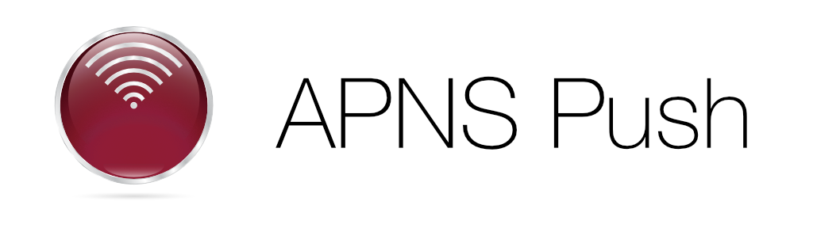

# APNSwift
HTTP/2 Apple Push Notification Service (APNs) push provider written in Swift

[](https://img.shields.io/cocoapods/v/APNSwift.svg)
[](http://cocoadocs.org/docsets/APNSwift)
[](http://cocoadocs.org/docsets/APNSwift)


## Features
- Sends notification using new HTTP/2 protocol
- Send notifications iOS, tvOS and macOS apps

# Installation
##CocoaPods
[CocoaPods](http://cocoapods.org) adds supports for Swift and embedded frameworks.

To integrate APNSwift into your Xcode project using CocoaPods, specify it in your `Podfile`:

```ruby

pod 'APNSwift'
```

## Usage
### APNS Connection can be created by `SecIdentity` or `PKCS certificate file`
```swift
guard let apns = APNS(certificatePath: "/path/to/PKCS/certificate", passphrase: "********") else {
    //Failed to create APNS object
    return nil
}

let apnsConnection = APNS(identity: certificateIdentity, options: apnsOptions)
```

### Push Notification options
```swift
var apnsOptions = APNS.Options()
apnsOptions.topic = "Weekend deal"
apnsOptions.port = .p2197
apnsOptions.expiry = NSDate()
apnsOptions.development = false
```

### Push
```swift
try! apnsConnection.sendPush(tokenList: tokens, payload: jsonPayLoad) {
    (apnsResponse) in
    Swift.print("\n\(apnsResponse.deviceToken)")
    Swift.print("  Status: \(apnsResponse.serviceStatus)")
    Swift.print("  APNS ID: \(apnsResponse.apnsId ?? "")")
    if let errorReason = apnsResponse.errorReason {
        Swift.print("  ERROR: \(errorReason)")
    }
}
```
# Mac App

<p align="center">
<a href="https://itunes.apple.com/us/app/apns-push/id1137371380?ls=1&mt=12">
    
</a>
</p>

[APNS Push](https://itunes.apple.com/us/app/apns-push/id1137371380?ls=1&mt=12) is a Mac app that allows you to send notifications over a `HTTP/2` connection. APNS Push app uses the `APNSwift` library to send push notifications

Now seamlessly send Push Notifications to your iPhone, iPad, Mac and Safari

### Features
- Directly send notifications using Certificates in KeyChain
- Also supports newly introduced Unified Push certificates
- `Basic mode` for quickly testing notifications
- `Advanced mode` for more fine grained control over push notifications

<p align="right">
<a href="https://itunes.apple.com/us/app/apns-push/id1137371380?ls=1&mt=12">
    
</a>
</p>
